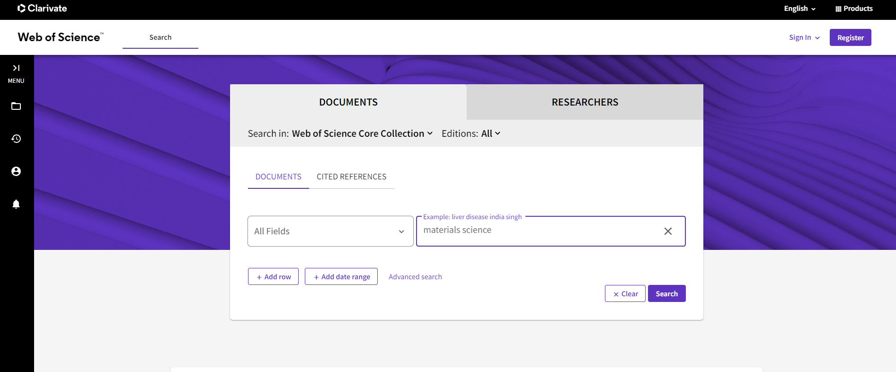
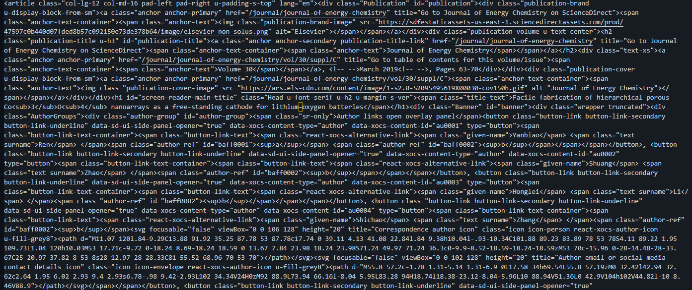

<h1 align="left"> PaperCrawler </h1>
<h3 align="left">Tutorials for implementing paper crawling from WoS </h3>

This is an example of collecting papers from WoS search engine.

## Requirements
- BeautifulSoup

- Selenium

- other general libraries such as time, pandas, numpy

## Usage
1. 'Downloader' requires an url link where your search results exist
   
2. 'Crawler' provides a set of HTML tags for each url. Here, HTML is a semi-structured data format, and thus parsing is necessary.
    

